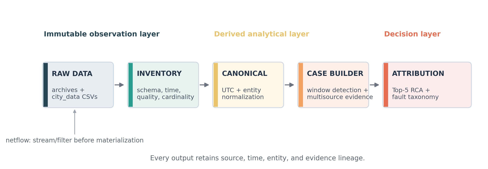
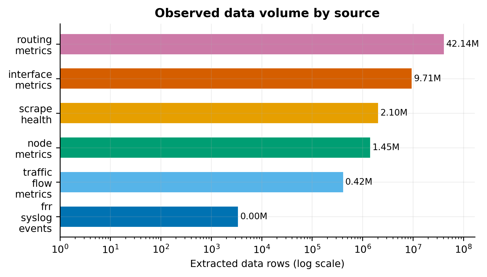
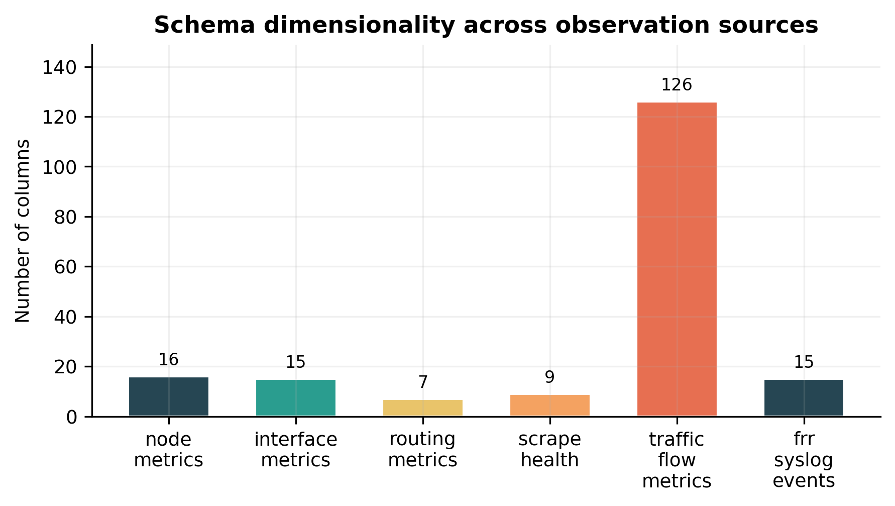
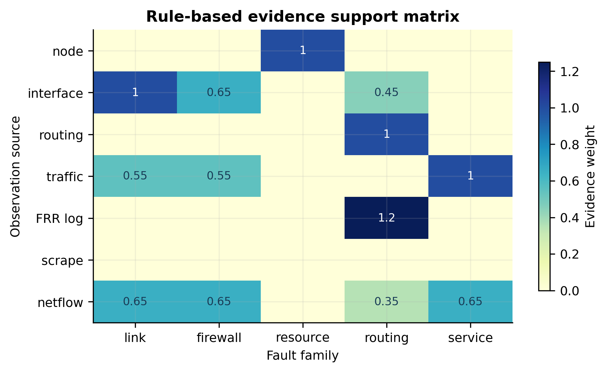

# 基于多源观测数据的骨干网故障诊断：数据工程与可解释归因报告

> 项目角色：数据负责人 @dyx  
> 生成时间：2026-09-19 15:57 UTC  
> 项目目录：`aiops_data_project/`  
> 研究性质：基于公开原始观测数据的可复现数据分析、官方 Case 归因解释与字段证据审计



图 1. 从不可变原始层到可解释归因层的数据 pipeline。netflow 在高基数场景下先做时间窗口过滤和聚合，再进入证据融合。

## 1. 问题定义与数据边界

根据项目说明，本任务有两个输出：

1. 对每一个故障时间窗输出 Top-5 根因网元排序；
2. 将根因归入故障大类和子类。

公开 taxonomy 包含 5 个大类、28 个子类：

| 大类 | 子类 |
| --- | --- |
| link | delay, rate_limit, loss |
| firewall | acl_drop, rate_limit, port_block, cpu_pressure, default_route_error, rule_order_error |
| resource | cpu_pressure, memory_pressure, disk_io_pressure, disk_space_low, process_pressure, softirq_pressure |
| routing | blackhole, bgp_session_down, bgp_route_flap, wrong_static_route, ospf6_neighbor_down, ospf6_cost_anomaly, wrong_default_route |
| service | dns_down, dns_wrong_record, web_5xx, web_slow, auth_timeout, auth_error |

当前原始数据没有显式 `case_id`、`root_cause` 或 `fault_category` 字段，这是因为这些字段属于官方 Case / 评测标注层，而不是多源观测层。数据工程部分负责统计和规范化观测数据；归因部分使用官方已有 Case 的时间窗口，在窗口内解释为什么定位到官方根因网元、为什么归入官方故障分类，不自行重新定义 Case。

## 2. 原始数据组织与解压策略

原始压缩包及其城市目录均保留在项目根目录。每个城市目录沿用压缩包自带的层级：

```text
<city>_20260819040000_20260902040000/
└── <city>_20260819040000_20260902040000_data/
    ├── frr_syslog_events_*.csv
    ├── interface_metrics_*.csv
    ├── node_metrics_*.csv
    ├── routing_metrics_*.csv
    ├── scrape_health_*.csv
    └── traffic_flow_metrics.csv
```

已经解压 8 个城市的上述 6 类 CSV，共 48 个文件；原始压缩包未删除。netflow 没有整体展开，原因是 8 个城市明文体积约 96 GB。pipeline 通过 `--include-netflow` 提供显式开关，默认不复制和不展开这类文件。

## 3. 数据 inventory

### 3.1 数据源总体情况

| 数据源 | 源头/机制 | 观测粒度 | 文件数 | 数据行数 | 列数 | 当前存储 |
| --- | --- | --- | --- | --- | --- | --- |
| node_metrics | node exporter / host resource telemetry | one-minute node-level time series | 8 | 1,450,970 | 16 | extracted |
| interface_metrics | interface/network exporter telemetry | one-minute interface-level time series | 8 | 9,712,086 | 15 | extracted |
| routing_metrics | routing exporter; BGP, OSPF6 and IPv6 route telemetry | one-minute node/metric/label time series | 8 | 42,139,971 | 7 | extracted |
| scrape_health | Prometheus scrape health / observability plane | one-minute exporter-target health time series | 8 | 2,096,458 | 9 | extracted |
| traffic_flow_metrics | synthetic service probes / Prometheus flow metrics | service-flow observation by source, target and flow type | 8 | 421,227 | 126 | extracted |
| frr_syslog_events | FRR syslog; bgpd and ospf6d event stream | irregular routing-software event | 8 | 3,481 | 15 | extracted |
| netflow_5tuple | flow collector / NetFlow-like five-tuple records | minute-level five-tuple flow record | 0 | 0 | — | compressed_only_or_missing |



图 2. 已解压观测数据量。routing metrics 行数高，是因为它以长表形式保存多个路由指标和 label；行数大不代表信息维度一定更高。

### 3.2 Schema 维度



图 3. 各观测源字段数量。`traffic_flow_metrics` 的 126 列主要来自 DNS/Web/Auth/Elephant 四组重复指标，而不是 126 个完全独立的数据源。

### 3.3 关键数据质量规则

pipeline 对所有 CSV 采用流式读取，并统计以下质量项：

- 行数与列数；
- 首末观测时间；
- 列数不匹配的 malformed row；
- 缺失值比例；
- 实体字段基数及样例值；
- `NULL`、`\N`、空字符串、`NA` 等缺失标记；
- 不同城市的同名源文件表头一致性。

时间处理遵循公开项目约定：无时区的时间字符串按 UTC 解释，再统一转换为带时区的 UTC 时间。`event_time` 用于事件归因，`received_at` 和 `inserted_at` 只用于传输/入库延迟分析，不能替代事件发生时间。

## 4. 多源数据源头与作用

| 数据源 | 推断源头 | 实体键 | 主要故障族 | 在 pipeline 中的角色 |
| --- | --- | --- | --- | --- |
| node_metrics | node exporter / host resource telemetry | region, node, node_type | resource | primary anomaly signal |
| interface_metrics | interface/network exporter telemetry | region, node, node_type, interface_id, if_role | link, firewall, routing | primary anomaly signal |
| routing_metrics | routing exporter; BGP, OSPF6 and IPv6 route telemetry | region, node, node_type, metric_name, label | routing | primary anomaly signal |
| scrape_health | Prometheus scrape health / observability plane | region, target_id, node, exporter_type | observability | quality control and corroboration |
| traffic_flow_metrics | synthetic service probes / Prometheus flow metrics | source_region, target_region, target_domain, flow_type, protocol | service, link, firewall | primary service-impact signal |
| frr_syslog_events | FRR syslog; bgpd and ospf6d event stream | hostname, region, program, severity | routing | event corroboration |
| netflow_5tuple | flow collector / NetFlow-like five-tuple records | region, node, interface_id, protocol, src_addr, dst_addr, src_port, dst_port | link, firewall, service, routing | high-cardinality auxiliary evidence; stream first |



图 4. 规则化证据支持矩阵。数值表示该源对某一故障族的初始证据权重，不表示监督学习标签，也不代替 Case 内的时间先后和拓扑判断。

### 4.1 语义边界

不同数据源提供的是不同层级的证据：

```text
node_metrics       → 主机资源状态
interface_metrics  → 接口/链路状态
routing_metrics    → BGP、OSPF6、IPv6 路由控制面
scrape_health      → 监控采集质量
frr_syslog_events  → 路由软件离散事件
traffic_flow       → DNS、Web、Auth 服务体验
netflow            → 五元组与端口级流量事实
```

这些源不能互相替代。例如：

- `scrape_up=0` 表示观测中断，不自动等于设备故障；
- 服务错误率升高表示用户侧症状，不自动等于服务进程是根因；
- 接口异常可以是路由或资源故障的后果，不一定是链路根因；
- FRR 日志需要和 routing metrics 的状态变化对齐，不能只按日志数量排序。

## 5. 字段字典

字段字典由 `pipeline/inventory.py` 根据真实表头生成，同时使用 `pipeline/definitions.py` 中可审阅的语义映射。完整机器可读版本位于：

- `outputs/field_dictionary.csv`
- `outputs/field_dictionary.json`
- `outputs/schema_reference.csv`（包含未展开 netflow 的契约字段，标记为 `definition_reference_only`）

字段字典的每一行包含：字段所属源、原始字段名、数据类型、单位、语义、分析作用和原始缺失值标记。

| 源 | 字段 | 类型 | 单位 | 含义 | 分析作用 |
| --- | --- | --- | --- | --- | --- |
| frr_syslog_events | id | integer | event id | event record id | record key |
| frr_syslog_events | received_at | datetime | UTC | collector receive time | transport timing |
| frr_syslog_events | event_time | datetime | UTC | event occurrence time | join key |
| frr_syslog_events | received_at_raw | datetime | UTC | raw collector timestamp | audit field |
| frr_syslog_events | event_time_raw | datetime | UTC | raw event timestamp | audit field |
| frr_syslog_events | source_ip | string | IP address | syslog sender | entity context |
| frr_syslog_events | hostname | string | hostname | emitting network element | root-cause entity |
| frr_syslog_events | region | categorical | city alias | log region | join key |
| frr_syslog_events | facility | categorical | syslog facility | syslog facility | log context |
| frr_syslog_events | severity | categorical | level | log severity name | event weight |
| frr_syslog_events | severity_code | integer | syslog code | numeric severity code | event weight |
| frr_syslog_events | program | categorical | process | FRR daemon name | routing signature |
| frr_syslog_events | pid | integer | process id | daemon process id | log context |
| frr_syslog_events | message | string | free text | event message | routing evidence |
| frr_syslog_events | inserted_at | datetime | UTC | database insertion time | audit field |
| interface_metrics | timestamp | datetime | UTC minute | interface metric observation time | join key |
| interface_metrics | region | categorical | city alias | observation region | join key |
| interface_metrics | node | categorical | node id | interface owner | root-cause entity |
| interface_metrics | node_type | categorical | role family | interface owner role family | candidate context |
| interface_metrics | interface_id | categorical | interface id | observed interface | link localization |
| interface_metrics | if_role | categorical | role label | interface function when available | link context |
| interface_metrics | rx_bytes_rate | float | bytes/s | received byte rate | traffic evidence |
| interface_metrics | tx_bytes_rate | float | bytes/s | transmitted byte rate | traffic evidence |
| interface_metrics | rx_packets_rate | float | packets/s | received packet rate | traffic evidence |
| interface_metrics | tx_packets_rate | float | packets/s | transmitted packet rate | traffic evidence |
| interface_metrics | rx_drop_rate | float | drops/s | received packet drop rate | loss evidence |
| interface_metrics | tx_drop_rate | float | drops/s | transmitted packet drop rate | loss evidence |
| interface_metrics | rx_error_rate | float | errors/s | received packet error rate | loss evidence |
| interface_metrics | tx_error_rate | float | errors/s | transmitted packet error rate | loss evidence |
| interface_metrics | carrier_changes | float | count | interface carrier changes | link stability evidence |
| node_metrics | timestamp | datetime | UTC minute | host metric observation time | join key |
| node_metrics | region | categorical | city alias | observation region | join key |
| node_metrics | node | categorical | node id | observed network element | root-cause entity |
| node_metrics | node_type | categorical | role family | device role family | candidate context |
| node_metrics | cpu_usage | float | ratio | CPU utilization | resource evidence |
| node_metrics | load1 | float | load | one-minute system load | resource evidence |
| node_metrics | load5 | float | load | five-minute system load | resource evidence |
| node_metrics | memory_available_ratio | float | ratio | available memory ratio | resource evidence |
| node_metrics | swap_used_ratio | float | ratio | used swap ratio | resource evidence |
| node_metrics | disk_read_rate | float | bytes/s | disk read rate | resource evidence |
| node_metrics | disk_write_rate | float | bytes/s | disk write rate | resource evidence |
| node_metrics | disk_io_util | float | ratio | disk I/O utilization | resource evidence |
| node_metrics | filesystem_used_ratio | float | ratio | filesystem used ratio | resource evidence |
| node_metrics | inode_used_ratio | float | ratio | inode used ratio | resource evidence |
| node_metrics | open_fd_ratio | float | ratio | open file descriptor ratio | resource evidence |
| node_metrics | process_count | float | count | running process count | resource evidence |
| routing_metrics | timestamp | datetime | UTC minute | routing metric observation time | join key |
| routing_metrics | region | categorical | city alias | observation region | join key |
| routing_metrics | node | categorical | node id | routing metric owner | root-cause entity |
| routing_metrics | node_type | categorical | role family | routing metric owner role family | candidate context |
| routing_metrics | metric_name | categorical | metric name | routing control-plane metric | routing signature |
| routing_metrics | label | structured string | Prometheus-like labels | peer, command or route context | routing disambiguation |
| routing_metrics | value | float-or-string | metric-specific | metric value | routing evidence |
| scrape_health | timestamp | datetime | UTC minute | scrape attempt time | join key |
| scrape_health | region | categorical | city alias | observation region | join key |
| scrape_health | target_id | categorical | exporter target | scrape target address | observability entity |
| scrape_health | node | categorical | node id | scrape target owner | observability entity |
| scrape_health | exporter_type | categorical | exporter name | node or routing exporter | source context |
| scrape_health | scrape_up | integer | 0/1 | whether scrape succeeded | data quality evidence |
| scrape_health | scrape_duration_seconds | float | seconds | scrape duration | observability evidence |
| scrape_health | scrape_samples | integer | samples | samples returned by scrape | observability evidence |
| scrape_health | scrape_error | string | message | scrape error when present | observability evidence |
| traffic_flow_metrics | id | integer | metric-specific | record id | record key |
| traffic_flow_metrics | timestamp_utc | datetime | metric-specific | flow metric observation time | join key |
| traffic_flow_metrics | prometheus_sample_time_utc | datetime | metric-specific | underlying Prometheus sample time | audit timing |
| traffic_flow_metrics | series_key | string | metric-specific | stable metric series hash | series key |
| traffic_flow_metrics | flow_type | categorical | metric-specific | DNS/Web/Auth/Elephant flow family | service context |
| traffic_flow_metrics | source_region | categorical | metric-specific | probe source region | join key |
| traffic_flow_metrics | source_ip | string | metric-specific | probe source IP | flow context |
| traffic_flow_metrics | target_region | categorical | metric-specific | target service region | impact localization |
| traffic_flow_metrics | target_domain | categorical | metric-specific | target service domain | service localization |
| traffic_flow_metrics | protocol | categorical | metric-specific | application/transport protocol | flow context |
| traffic_flow_metrics | dns_flow_active | float | metric-specific | dns_flow currently active operations/flows | current load evidence |
| traffic_flow_metrics | dns_flow_batch_concurrency | float | metric-specific | dns_flow concurrent probe batches | current load evidence |
| traffic_flow_metrics | dns_flow_batches_started_total | float | metric-specific | dns_flow cumulative started batches | counter; derive rates |
| traffic_flow_metrics | dns_flow_batches_completed_total | float | metric-specific | dns_flow cumulative completed batches | counter; derive rates |
| traffic_flow_metrics | dns_flow_batches_failed_total | float | metric-specific | dns_flow cumulative failed batches | counter; derive rates |
| traffic_flow_metrics | dns_flow_batches_timeout_total | float | metric-specific | dns_flow cumulative timed-out batches | counter; derive rates |
| traffic_flow_metrics | dns_flow_requests_total | float | metric-specific | dns_flow cumulative requests | counter; derive rates |
| traffic_flow_metrics | dns_flow_success_total | float | metric-specific | dns_flow cumulative successful requests | counter; derive rates |
| traffic_flow_metrics | dns_flow_error_total | float | metric-specific | dns_flow cumulative error requests | counter; derive rates |
| traffic_flow_metrics | dns_flow_bytes_sent_total | float | metric-specific | dns_flow cumulative sent bytes | counter; derive rates |
| traffic_flow_metrics | dns_flow_bytes_received_total | float | metric-specific | dns_flow cumulative received bytes | counter; derive rates |
| traffic_flow_metrics | dns_flow_duration_seconds_sum | float | seconds | dns_flow cumulative request duration | counter; derive rates |
| traffic_flow_metrics | dns_flow_active_seconds_total | float | seconds | dns_flow cumulative active seconds | counter; derive rates |
| traffic_flow_metrics | dns_flow_duration_seconds_count | float | seconds | dns_flow number of duration observations | counter; derive rates |
| traffic_flow_metrics | dns_flow_batch_duration_seconds | float | seconds | dns_flow latest/observed batch duration | latency evidence |
| traffic_flow_metrics | dns_flow_last_batch_timestamp_seconds | float | seconds | dns_flow Unix timestamp of latest batch | timing context |
| traffic_flow_metrics | dns_flow_observed_qps | float | metric-specific | dns_flow observed queries per second | service load evidence |
| traffic_flow_metrics | dns_flow_latency_mean_seconds | float | seconds | dns_flow mean request latency | service latency evidence |
| traffic_flow_metrics | dns_flow_latency_p95_seconds | float | seconds | dns_flow 95th percentile request latency | service latency evidence |
| traffic_flow_metrics | dns_flow_request_latency_seconds_bucket_le_0_01 | float | count | dns_flow request latency histogram bucket 0_01 | latency evidence |
| traffic_flow_metrics | dns_flow_request_latency_seconds_bucket_le_0_025 | float | count | dns_flow request latency histogram bucket 0_025 | latency evidence |
| traffic_flow_metrics | dns_flow_request_latency_seconds_bucket_le_0_05 | float | count | dns_flow request latency histogram bucket 0_05 | latency evidence |
| traffic_flow_metrics | dns_flow_request_latency_seconds_bucket_le_0_1 | float | count | dns_flow request latency histogram bucket 0_1 | latency evidence |
| traffic_flow_metrics | dns_flow_request_latency_seconds_bucket_le_0_25 | float | count | dns_flow request latency histogram bucket 0_25 | latency evidence |
| traffic_flow_metrics | dns_flow_request_latency_seconds_bucket_le_0_5 | float | count | dns_flow request latency histogram bucket 0_5 | latency evidence |
| traffic_flow_metrics | dns_flow_request_latency_seconds_bucket_le_1 | float | count | dns_flow request latency histogram bucket 1 | latency evidence |
| traffic_flow_metrics | dns_flow_request_latency_seconds_bucket_le_2_5 | float | count | dns_flow request latency histogram bucket 2_5 | latency evidence |
| traffic_flow_metrics | dns_flow_request_latency_seconds_bucket_le_5 | float | count | dns_flow request latency histogram bucket 5 | latency evidence |
| traffic_flow_metrics | dns_flow_request_latency_seconds_bucket_le_plus_inf | float | count | dns_flow request latency histogram bucket plus_inf | latency evidence |
| traffic_flow_metrics | dns_flow_request_latency_seconds_sum | float | seconds | dns_flow request latency sum | counter; derive rates |
| traffic_flow_metrics | dns_flow_request_latency_seconds_count | float | seconds | dns_flow request latency sample count | counter; derive rates |
| traffic_flow_metrics | web_flow_active | float | metric-specific | web_flow currently active operations/flows | current load evidence |
| traffic_flow_metrics | web_flow_batch_concurrency | float | metric-specific | web_flow concurrent probe batches | current load evidence |
| traffic_flow_metrics | web_flow_batches_started_total | float | metric-specific | web_flow cumulative started batches | counter; derive rates |
| traffic_flow_metrics | web_flow_batches_completed_total | float | metric-specific | web_flow cumulative completed batches | counter; derive rates |
| traffic_flow_metrics | web_flow_batches_failed_total | float | metric-specific | web_flow cumulative failed batches | counter; derive rates |
| traffic_flow_metrics | web_flow_batches_timeout_total | float | metric-specific | web_flow cumulative timed-out batches | counter; derive rates |
| traffic_flow_metrics | web_flow_requests_total | float | metric-specific | web_flow cumulative requests | counter; derive rates |
| traffic_flow_metrics | web_flow_success_total | float | metric-specific | web_flow cumulative successful requests | counter; derive rates |
| traffic_flow_metrics | web_flow_error_total | float | metric-specific | web_flow cumulative error requests | counter; derive rates |
| traffic_flow_metrics | web_flow_bytes_sent_total | float | metric-specific | web_flow cumulative sent bytes | counter; derive rates |
| traffic_flow_metrics | web_flow_bytes_received_total | float | metric-specific | web_flow cumulative received bytes | counter; derive rates |
| traffic_flow_metrics | web_flow_duration_seconds_sum | float | seconds | web_flow cumulative request duration | counter; derive rates |
| traffic_flow_metrics | web_flow_active_seconds_total | float | seconds | web_flow cumulative active seconds | counter; derive rates |
| traffic_flow_metrics | web_flow_duration_seconds_count | float | seconds | web_flow number of duration observations | counter; derive rates |
| traffic_flow_metrics | web_flow_batch_duration_seconds | float | seconds | web_flow latest/observed batch duration | latency evidence |
| traffic_flow_metrics | web_flow_last_batch_timestamp_seconds | float | seconds | web_flow Unix timestamp of latest batch | timing context |
| traffic_flow_metrics | web_flow_observed_qps | float | metric-specific | web_flow observed queries per second | service load evidence |
| traffic_flow_metrics | web_flow_latency_mean_seconds | float | seconds | web_flow mean request latency | service latency evidence |
| traffic_flow_metrics | web_flow_latency_p95_seconds | float | seconds | web_flow 95th percentile request latency | service latency evidence |
| traffic_flow_metrics | web_flow_request_latency_seconds_bucket_le_0_01 | float | count | web_flow request latency histogram bucket 0_01 | latency evidence |
| traffic_flow_metrics | web_flow_request_latency_seconds_bucket_le_0_025 | float | count | web_flow request latency histogram bucket 0_025 | latency evidence |
| traffic_flow_metrics | web_flow_request_latency_seconds_bucket_le_0_05 | float | count | web_flow request latency histogram bucket 0_05 | latency evidence |
| traffic_flow_metrics | web_flow_request_latency_seconds_bucket_le_0_1 | float | count | web_flow request latency histogram bucket 0_1 | latency evidence |
| traffic_flow_metrics | web_flow_request_latency_seconds_bucket_le_0_25 | float | count | web_flow request latency histogram bucket 0_25 | latency evidence |
| traffic_flow_metrics | web_flow_request_latency_seconds_bucket_le_0_5 | float | count | web_flow request latency histogram bucket 0_5 | latency evidence |
| traffic_flow_metrics | web_flow_request_latency_seconds_bucket_le_1 | float | count | web_flow request latency histogram bucket 1 | latency evidence |
| traffic_flow_metrics | web_flow_request_latency_seconds_bucket_le_2_5 | float | count | web_flow request latency histogram bucket 2_5 | latency evidence |
| traffic_flow_metrics | web_flow_request_latency_seconds_bucket_le_5 | float | count | web_flow request latency histogram bucket 5 | latency evidence |
| traffic_flow_metrics | web_flow_request_latency_seconds_bucket_le_plus_inf | float | count | web_flow request latency histogram bucket plus_inf | latency evidence |
| traffic_flow_metrics | web_flow_request_latency_seconds_sum | float | seconds | web_flow request latency sum | counter; derive rates |
| traffic_flow_metrics | web_flow_request_latency_seconds_count | float | seconds | web_flow request latency sample count | counter; derive rates |
| traffic_flow_metrics | auth_flow_active | float | metric-specific | auth_flow currently active operations/flows | current load evidence |
| traffic_flow_metrics | auth_flow_batch_concurrency | float | metric-specific | auth_flow concurrent probe batches | current load evidence |
| traffic_flow_metrics | auth_flow_batches_started_total | float | metric-specific | auth_flow cumulative started batches | counter; derive rates |
| traffic_flow_metrics | auth_flow_batches_completed_total | float | metric-specific | auth_flow cumulative completed batches | counter; derive rates |
| traffic_flow_metrics | auth_flow_batches_failed_total | float | metric-specific | auth_flow cumulative failed batches | counter; derive rates |
| traffic_flow_metrics | auth_flow_batches_timeout_total | float | metric-specific | auth_flow cumulative timed-out batches | counter; derive rates |
| traffic_flow_metrics | auth_flow_requests_total | float | metric-specific | auth_flow cumulative requests | counter; derive rates |
| traffic_flow_metrics | auth_flow_success_total | float | metric-specific | auth_flow cumulative successful requests | counter; derive rates |
| traffic_flow_metrics | auth_flow_error_total | float | metric-specific | auth_flow cumulative error requests | counter; derive rates |
| traffic_flow_metrics | auth_flow_bytes_sent_total | float | metric-specific | auth_flow cumulative sent bytes | counter; derive rates |
| traffic_flow_metrics | auth_flow_bytes_received_total | float | metric-specific | auth_flow cumulative received bytes | counter; derive rates |
| traffic_flow_metrics | auth_flow_duration_seconds_sum | float | seconds | auth_flow cumulative request duration | counter; derive rates |
| traffic_flow_metrics | auth_flow_active_seconds_total | float | seconds | auth_flow cumulative active seconds | counter; derive rates |
| traffic_flow_metrics | auth_flow_duration_seconds_count | float | seconds | auth_flow number of duration observations | counter; derive rates |
| traffic_flow_metrics | auth_flow_batch_duration_seconds | float | seconds | auth_flow latest/observed batch duration | latency evidence |
| traffic_flow_metrics | auth_flow_last_batch_timestamp_seconds | float | seconds | auth_flow Unix timestamp of latest batch | timing context |
| traffic_flow_metrics | auth_flow_observed_qps | float | metric-specific | auth_flow observed queries per second | service load evidence |
| traffic_flow_metrics | auth_flow_latency_mean_seconds | float | seconds | auth_flow mean request latency | service latency evidence |
| traffic_flow_metrics | auth_flow_latency_p95_seconds | float | seconds | auth_flow 95th percentile request latency | service latency evidence |
| traffic_flow_metrics | auth_flow_request_latency_seconds_bucket_le_0_01 | float | count | auth_flow request latency histogram bucket 0_01 | latency evidence |
| traffic_flow_metrics | auth_flow_request_latency_seconds_bucket_le_0_025 | float | count | auth_flow request latency histogram bucket 0_025 | latency evidence |
| traffic_flow_metrics | auth_flow_request_latency_seconds_bucket_le_0_05 | float | count | auth_flow request latency histogram bucket 0_05 | latency evidence |
| traffic_flow_metrics | auth_flow_request_latency_seconds_bucket_le_0_1 | float | count | auth_flow request latency histogram bucket 0_1 | latency evidence |
| traffic_flow_metrics | auth_flow_request_latency_seconds_bucket_le_0_25 | float | count | auth_flow request latency histogram bucket 0_25 | latency evidence |
| traffic_flow_metrics | auth_flow_request_latency_seconds_bucket_le_0_5 | float | count | auth_flow request latency histogram bucket 0_5 | latency evidence |
| traffic_flow_metrics | auth_flow_request_latency_seconds_bucket_le_1 | float | count | auth_flow request latency histogram bucket 1 | latency evidence |
| traffic_flow_metrics | auth_flow_request_latency_seconds_bucket_le_2_5 | float | count | auth_flow request latency histogram bucket 2_5 | latency evidence |
| traffic_flow_metrics | auth_flow_request_latency_seconds_bucket_le_5 | float | count | auth_flow request latency histogram bucket 5 | latency evidence |
| traffic_flow_metrics | auth_flow_request_latency_seconds_bucket_le_plus_inf | float | count | auth_flow request latency histogram bucket plus_inf | latency evidence |
| traffic_flow_metrics | auth_flow_request_latency_seconds_sum | float | seconds | auth_flow request latency sum | counter; derive rates |
| traffic_flow_metrics | auth_flow_request_latency_seconds_count | float | seconds | auth_flow request latency sample count | counter; derive rates |
| traffic_flow_metrics | elephant_flow_active | float | metric-specific | elephant_flow currently active operations/flows | current load evidence |
| traffic_flow_metrics | elephant_flow_batch_concurrency | float | metric-specific | elephant_flow concurrent probe batches | current load evidence |
| traffic_flow_metrics | elephant_flow_batches_started_total | float | metric-specific | elephant_flow cumulative started batches | counter; derive rates |
| traffic_flow_metrics | elephant_flow_batches_completed_total | float | metric-specific | elephant_flow cumulative completed batches | counter; derive rates |
| traffic_flow_metrics | elephant_flow_batches_failed_total | float | metric-specific | elephant_flow cumulative failed batches | counter; derive rates |
| traffic_flow_metrics | elephant_flow_batches_timeout_total | float | metric-specific | elephant_flow cumulative timed-out batches | counter; derive rates |
| traffic_flow_metrics | elephant_flow_requests_total | float | metric-specific | elephant_flow cumulative requests | counter; derive rates |
| traffic_flow_metrics | elephant_flow_success_total | float | metric-specific | elephant_flow cumulative successful requests | counter; derive rates |
| traffic_flow_metrics | elephant_flow_error_total | float | metric-specific | elephant_flow cumulative error requests | counter; derive rates |
| traffic_flow_metrics | elephant_flow_bytes_sent_total | float | metric-specific | elephant_flow cumulative sent bytes | counter; derive rates |
| traffic_flow_metrics | elephant_flow_bytes_received_total | float | metric-specific | elephant_flow cumulative received bytes | counter; derive rates |
| traffic_flow_metrics | elephant_flow_duration_seconds_sum | float | seconds | elephant_flow cumulative request duration | counter; derive rates |
| traffic_flow_metrics | elephant_flow_active_seconds_total | float | seconds | elephant_flow cumulative active seconds | counter; derive rates |
| traffic_flow_metrics | elephant_flow_duration_seconds_count | float | seconds | elephant_flow number of duration observations | counter; derive rates |
| traffic_flow_metrics | elephant_flow_batch_duration_seconds | float | seconds | elephant_flow latest/observed batch duration | latency evidence |
| traffic_flow_metrics | elephant_flow_last_batch_timestamp_seconds | float | seconds | elephant_flow Unix timestamp of latest batch | timing context |
| traffic_flow_metrics | elephant_flow_observed_qps | float | metric-specific | elephant_flow observed queries per second | service load evidence |
| traffic_flow_metrics | elephant_flow_latency_mean_seconds | float | seconds | elephant_flow mean request latency | service latency evidence |
| traffic_flow_metrics | elephant_flow_latency_p95_seconds | float | seconds | elephant_flow 95th percentile request latency | service latency evidence |
| traffic_flow_metrics | elephant_flow_throughput_bps | float | metric-specific | elephant_flow throughput in bits per second | network performance evidence |
| traffic_flow_metrics | elephant_flow_retransmits_total | float | metric-specific | elephant_flow cumulative retransmissions | counter; derive rates |
| traffic_flow_metrics | elephant_flow_loss_rate | float | ratio | elephant_flow packet/flow loss ratio | loss evidence |
| traffic_flow_metrics | elephant_flow_jitter_seconds | float | seconds | elephant_flow latency variation | delay evidence |

对于长表和宽表，需要特别注意：

1. `routing_metrics` 的语义由 `metric_name + label + value` 共同决定；
2. `traffic_flow_metrics` 的 `*_total`、`*_sum`、`*_count` 是累计量，pipeline 不直接对累计量做五阶异常检测，而应先做差分或窗口速率；
3. `netflow` 的 `node_key`、`node`、`interface_id` 和地址端口共同描述一条流，不能只按 node 聚合后丢失五元组信息；
4. `NULL` 和 `\N` 都应在规范化层映射为缺失，但原始值必须在审计层保留。

## 6. Pipeline 设计

### 6.1 处理阶段

```text
P0  原始层登记
    压缩包、分卷、城市目录、文件大小

P1  数据 inventory
    表头、行数、时间范围、缺失值、实体基数、质量问题

P2  规范化
    UTF-8 BOM、UTC、缺失标记、数字类型、node/interface/hostname 映射

P3  官方 Case 对齐
    官方 Case 时间窗 → 8 个城市 × 多源观测窗口

P4  证据融合
    局部异常、时间先后、多源一致性、参考拓扑、症状传播

P5  输出
    Top-5 根因、fault_category、解释文本、机器可读 JSONL/CSV
```

### 6.2 官方 Case 的处理单位

一个官方 Case 不是由本项目重新切出的异常窗口，而是官方给定的全网时间窗口：

```text
OfficialCase_i = [official_start_time, official_end_time]
                × 8 个城市
                × 全部观测源
                × 全部候选网元
```

窗口内必须同时提取 8 个城市的数据。只查看官方根因所在城市会丢失传播证据，也无法解释为什么其他网元没有被定位为根因。

### 6.3 官方 Case 归因数据流

1. 读取官方 Case 的 `case_id`、`start_time` 和 `end_time`；
2. 按时间窗口从所有城市和观测源提取数据；
3. 依据公开网络元素清单建立完整候选网元集合；
4. 为每个候选网元保留窗口内的局部异常证据、时间先后和数据源；
5. 结合参考拓扑判断根因和下游症状；
6. 用字段机制和官方 taxonomy 解释大类、子类；
7. 将官方答案与证据解释并列保存，不把官方标签当作输入特征。

项目仍提供 `--official-baseline-only` 用于复现公开 five-sigma 的窗口检测规则，但它是 baseline 的候选窗口组件，不是替代官方 Case 清单的 Case 构造器。由于当前目录是连续约 14 天的原始包，直接全量运行该 detector 会得到一个超长兼容性窗口；这个结果只用于核对 baseline 接口，不能替代官方 Case。

## 7. 官方 Case 的根因定位与故障分类解释

### 7.1 为什么定位到这个网元

对官方 Case 的根因解释必须同时检查：

1. 该网元是否在官方窗口内出现与故障机制直接对应的字段异常；
2. 该异常是否早于其他网元的传播性症状；
3. 异常是否集中在该网元，而不是全网采集失败或共同的观测伪影；
4. 参考拓扑是否支持“该网元影响其他网元”的传播关系；
5. 是否存在更早、更直接的资源、接口或控制面证据可以替代当前候选。

因此，根因定位不是“异常值最大的设备”，而是“时间、机制、局部性和传播关系共同最符合的设备”。

### 7.2 为什么分类成这个故障

故障分类首先依据字段所表达的故障机制，再判断子类：

| 证据族 | 典型字段/事件 | 分类解释 |
| --- | --- | --- |
| 资源 | CPU、load、memory、disk IO、filesystem、process | 说明主机资源压力，再由具体字段区分 CPU、内存、磁盘、进程等子类 |
| 链路 | drop、error、carrier、loss、latency、jitter | 说明接口或链路质量问题，不能只凭字节/包速率升高分类 |
| 路由 | BGP peer、prefix、OSPF6 neighbor、route change、FRR log | 说明控制面状态或路由协议故障 |
| 服务 | DNS/Web/Auth 延迟、QPS、失败、超时 | 说明用户侧服务异常，需要排除更早的资源或网络根因 |
| 防火墙 | firewall 网元、端口选择性异常、丢弃模式 | 说明策略、规则、端口或防火墙资源导致的流量选择性失败 |

分类说明必须同时写出反证。例如，`disk_io_pressure` 需要说明磁盘利用率和读写速率直接饱和，而 CPU/load 升高可能只是 I/O 等待的伴随症状；`bgp_session_down` 需要说明 peer 状态和前缀接收变化，而不是只看到业务流量下降。

### 7.3 公开 baseline 样例 Case 结果

下表使用公开 baseline 的官方样例 Case，展示“已有 Case → 窗口证据 → 定位原因 → 分类原因”的写法：

| 官方 Case | 根因网元 | 官方分类 | 关键字段 | 为什么定位 | 为什么分类 |
| --- | --- | --- | --- | --- | --- |
| incident-0013 | xian-service-vm-1 | resource/cpu_pressure | cpu_usage, load1, load5, memory_available_ratio | xian-service-vm-1 在官方窗口内同时出现 CPU 使用状态和 load 指标的突变，且该异常直接发生在 service-vm-1 上；其他资源字段没有呈现同等强度的同步变化，因此该网元比同城其他候选更符合根因位置。 | cpu_usage、load1、load5 都属于主机资源压力证据，异常机制是计算资源争用而不是链路、路由或服务协议状态变化，因此归入 resource/cpu_pressure。 |
| incident-0017 | guangzhou-service-vm-3 | resource/memory_pressure | memory_available_ratio, swap_used_ratio, cpu_usage | guangzhou-service-vm-3 在官方窗口内出现可用内存比例从约 0.9234 降至 0.8505–0.8552 的明显变化，异常直接落在该 service-vm 上；CPU/load 的同步变化可以作为资源压力伴随现象，但不能取代内存字段对根因的指示。 | memory_available_ratio 是内存压力的直接观测字段，核心异常表现是可用内存下降，因此归入 resource/memory_pressure，而不是仅依据 CPU 波动归为 cpu_pressure。 |
| incident-0021 | wuhan-service-vm-2 | resource/disk_io_pressure | disk_io_util, disk_read_rate, disk_write_rate, memory_available_ratio | wuhan-service-vm-2 在官方窗口内的 disk_io_util 达到 85.45–100%，同时读写速率相对窗口前基线出现数量级变化；这些直接磁盘 I/O 证据集中出现在该网元，因此比同一窗口内的 CPU/load 伴随变化更接近根因。 | disk_io_util、disk_read_rate 和 disk_write_rate 共同指向存储子系统饱和，故障属于 resource/disk_io_pressure；它不是内存压力，因为 memory_available_ratio 基本稳定，也不是链路故障，因为直接证据来自主机磁盘资源。 |

逐 Case 的窗口统计、反证和解释字段见：[official_case_attribution_examples.json](outputs/official_case_attribution_examples.json)。

`candidate_cases.json` 仍然保留，但只用于连续原始数据的探索性异常审计，不能替代官方 Case 或官方答案。

## 9. 运行方式

在项目根目录执行：

```bash
python3 aiops_data_project/run_pipeline.py
```

默认行为：

- 扫描已解压 CSV；
- 生成 inventory、字段字典和源头映射；
- 不展开、不读取未落盘的 netflow；
- 不从连续原始数据构造官方 Case；
- 生成 PDF/PNG 图表；
- 生成本报告。

如需生成连续原始数据上的探索性异常审计结果，必须显式运行：

```bash
python3 aiops_data_project/run_pipeline.py --exploratory-cases
```

如果后续磁盘空间足够并且已经把 netflow 放入对应城市 `_data` 目录，可以显式运行：

```bash
python3 aiops_data_project/run_pipeline.py --include-netflow
```

只重新生成图和报告：

```bash
python3 aiops_data_project/run_pipeline.py --report-only
```

## 10. 局限与下一步

当前项目已经完成数据负责人部分的第一版闭环，但以下内容仍然需要和模型负责人共同确认：

1. 真实比赛 Case 的数量和隐藏故障窗口；
2. `monitor-vm` 等没有直接观测记录的候选网元如何进入模型输入；
3. 当前公开参考拓扑与真实网络拓扑之间的差异；
4. netflow 的窗口聚合粒度和是否需要加入 baseline；
5. 累计计数器的差分特征；
6. firewall 与 link/routing/service 的判别优先级；
7. 候选 Case 与提交结果的时间边界校准。

因此最终交付不应只有一个预测文件，而应同时保留：

```text
预测结果
+ Case 时间窗
+ Top-5 候选
+ 关键证据
+ 分类依据
+ 反证与不确定性
```

这能保证模型结果可复盘，也能在评测分数不理想时定位问题究竟来自异常检测、时间窗、根因排序还是故障分类。

## 附录：项目文件

| 文件 | 作用 |
| --- | --- |
| `run_pipeline.py` | 一键运行 pipeline、图表和报告 |
| `pipeline/definitions.py` | 数据源、字段、taxonomy、候选网元和证据规则 |
| `pipeline/inventory.py` | 流式 inventory、字段字典和源头映射 |
| `pipeline/cases.py` | 连续原始数据的探索性异常审计，不替代官方 Case |
| `figures/generate_figures.py` | 学术级 PNG/PDF 图表生成 |
| `outputs/inventory.json` | 机器可读数据总览 |
| `outputs/field_dictionary.csv` | 完整字段字典 |
| `outputs/schema_reference.csv` | 未展开源的契约字段定义与状态标记 |
| `outputs/source_mapping.csv` | 多源数据来源与诊断作用 |
| `outputs/candidate_cases.jsonl` | 逐 Case 机器可读归因结果 |
| `outputs/official_baseline_events.jsonl` | 公开 five-sigma 规则生成的候选时间窗（可选） |
| `outputs/official_case_attribution_examples.json` | 公开 baseline 官方样例 Case 的窗口证据与归因解释 |

## 参考资料

- [项目说明](../AIOPS_OnePage.md)
- [数据集 README](../README.md)
- [公开 baseline](https://gitee.com/murina/aiops-challenge-2026)
- [提交格式与 taxonomy](https://gitee.com/lin-xianghong/aiops-challenge2026-submission)
