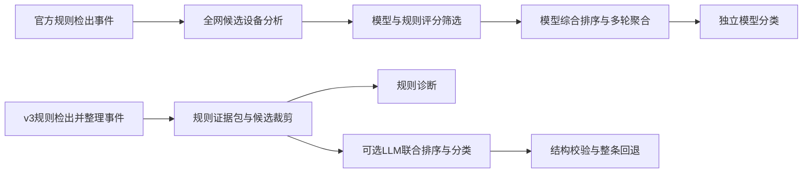

# v3、官方 Baseline 与官网规则复核

复核日期：2026-10-08（北京时间）。结论依据分为实际代码/产物、项目汇报记录、官方页面、分析推断四类；不将格式检查通过视为准确率证据。本次只新增审查材料，未修改算法、预测或提交结果。

**1. 当前状态与证据边界**

- 当前分支 `v3`，HEAD 为 `ade4ac5`：撤回 `acfa961` 的分阶段 LLM 改动。当前没有 `staged_llm.py`、`evidence_context.py` 或字段级证据门控实现。
- 官方 Baseline 对照为 `official-baseline` 的 `07b6d136c7b85d41cba847c18eeb0d4ffa86e472`。本次通过 `git ls-remote upstream HEAD` 确认官方远端 HEAD 仍为该提交。
- README 指向的根目录 `result.jsonl` 当前不存在。实际可核查的 395 条文件是 [已验证合并产物](../outputs/v3/stage1_exact_bgp_candidate_stage2_control_verified_20261003.jsonl)，SHA-256 为 `273dba7296935e533c516026b44c749bfdc4388e6c0ec140bc3e108797da1505`。
- 这组产物第一批 319 条、第二批 76 条，两个 manifest 均为 `mode=rules`、`llm_responses_sha256=null`。因此它是规则对照，不能拿它证明模型实际参与了判断。
- [10 月 8 日本地汇报](../汇报.md:98)记录另一次 Qwen3-8B-AWQ 实验：395 条中 394 条响应通过，1 条回退；Top5 改动 25 条、Top1 改动 12 条、类别改动 4 条；总分从 22.7896 变为 22.7509。本机 `data/` 与 `outputs/` 未找到相应响应/LLM 预测产物，未获取该次官方提交回执，故这些数据属于汇报记录，尚不能独立重演。
- README、服务器说明仍写未实测，与本地汇报冲突；本地汇报写分阶段代码已完成，与当前 HEAD 的撤回状态冲突。报告中的历史完成状态不能当作当前分支的能力。

**2. LLM 参与环节对比**

| 环节 | 官方 BiAn Baseline，开启 `--use-llm` | 当前 v3 |
| --- | --- | --- |
| 异常发现、事件起止 | 通用 Five-Sigma 脚本；LLM 不修改事件 | MAD/绝对门槛/状态规则；LLM 不修改事件 |
| 初始候选 | 全部 80 个合法网元进入候选上下文 | 直接异常、同城、业务目标城市和少量路由上下文；程序裁剪至最多 12 个 |
| 设备分析 | 7B-A 分批分析，输出异常分数、证据摘要 | 无独立模型分析步骤；程序生成信号、候选分数和原因 |
| 第一阶段排序 | 7B-B 给候选评分，模型权重 0.65、规则权重 0.35，筛成 5 个 | 规则按峰值异常分数和固定上下文分数排序 |
| 综合根因排序 | 7B-B 结合时间、参考拓扑、模式兼容性和症状倾向评分；3 轮 Rank-of-Ranks | 可选 LLM 单次请求，在已给候选中选取/重排 5 个；实际保存的对照产物用规则 |
| 分类 | 根因排序后单独请求分类，3 轮投票 | 可选 LLM 在同一次请求中输出根因及类别；规则路径直接映射指标 |
| 失败处理 | 完整 LLM 路径报错终止；无模型快速验证输出 unknown，不作为比赛结果 | 无效响应整条回退规则；没有根因/类别分别回退 |
| 推理后校验 | 验证分数、网元、类别等结构 | 证据哈希、合法候选、类别组合、引用 ID 等结构约束 |

官方参考中的 7B-A 与 7B-B 是同一个模型 backend 的两个逻辑角色，不要求两套权重或两张 GPU。按公开配置 80 候选、batch size 4，完整路径每事件约为 `20+20+3+3=46` 次生成；v3 单次联合诊断每事件 1 次。调用更多不等于表现更好。官方实现采用贪心解码，重复轮次也不能自动解释为独立随机样本。

两条流程可以概括为：

Baseline 的优点是任务分解明确，但参考实现也有明显简化：检测排除 FRR 与 NetFlow CSV，设备证据主要来自 detector points；拓扑仅包含同城参考角色关系，没有完整跨城连接。不能把参考实现等同于完整 BiAn 或已经充分利用三源的系统。官网及仓库说明也没有给出可用于与 v3 比较的隐藏集 Baseline 分数。

官方 Baseline 当前远端的类别配置与 schema 仍按第一阶段 28 类，官网及更新后的提交仓库为 32 类。v3 扩展到 32 类符合现行枚举；借鉴 Baseline 推理结构时不应回退其旧类别表。

来源：[官方 Baseline README 与源码](https://gitee.com/murina/aiops-challenge-2026)，重点文件 `baseline/bian/run.py`、`localization/ranking.py`、`classification/classifier.py`、`preprocessing/evidence.py`、`config/topology.json`。

**3. 当前 v3 对模型的实际限制**

第一，事件入口固定。运行器先执行 [检测](../aiops_v3/run.py:124)，再构造证据并选择诊断。模型不能增删、拆合事件，不能修正起止时间，也看不到被检测器排除的候选窗口。因此漏检不可能靠这一 LLM 接口补救；官方匹配仅按区间进行，固定全部事件时间时，AD 分项也不会因根因/类别替换而改变。

第二，候选召回被规则封顶。[候选生成](../aiops_v3/diagnosis.py:217)优先直接异常，随后按城市补充，上限 12 个。两批实际候选为 10–12 个。真实根因若不在池内，即使模型理解正确也不能输出。规则 Top1 接近“异常最强设备”，没有真正实现路径传播和因果方向的定位。

第三，第一批弱定位比例很高。319 条里 184 条 Top1 有直接设备异常信号，135 条没有，约占 42.3%。业务症状事件中，服务 VM 常获得相同固定分数，随后按网元名称排序；这会偏向固定实例。域名到实例、探针访问路径和物理接口对端缺失，模型仅重排相同弱证据无法解决身份映射。第二批 76 条 Top1 都有直接异常信号，但“有异常”也不证明它是根因。

第四，模型可见证据不等于完整特征库。当前输入主要是触发峰值、规则已解释的类别、候选分数及前后五分钟的观测数/中位数；通常没有完整起始、传播和恢复轨迹。FRR/NetFlow 上下文主要加在直接异常候选上，NetFlow 协议边证据最多补 3 条；保留在侧车中的原始文本和逐接口/peer 信息并未全面进入 prompt。模型不能推理没有展示给它的材料。若要引入正常对照，应使用当前批次自动提取的观测，不能人工标注隐藏测试集。

第五，现有证据校验仅检查引用存在。[导入器](../aiops_v3/optional_llm.py:28)不会验证引用是否支持被选网元与故障类别。本次实际构造了一个仅含 `node.cpu_usage` 的证据包响应，将类别改成 `service/dns_wrong_record`，选择无直接证据的合法候选，并引用已有 CPU ID；导入器仍接受。这个实验说明存在语义校验缺口，不能证明历史 Qwen 响应实际犯了同一错误。

第六，可复现性检查分层不一致。服务器续跑会检查模型 revision 和 prompt/schema/解码哈希；Mac 导入器只强制绑定 event/evidence，不要求 `model` 和 `prompt_sha256` 存在，也不比对其值。当前整条回退会使一个非法类别丢掉原本合法的排序结果。JSON Schema 中大类和子类分别枚举也可能组合出非法 pair，最终由导入器拒绝。

第七，规则答案及预先排序的候选一起进入 prompt，而且要求证据不足就维持规则，可能产生锚定偏差。这是机制推断，并非已验证的模型错误。当前没有去掉规则答案、打乱候选顺序、仅换根因、仅换分类的成套可复核消融。

本地汇报中的总分下降只能说明该次固定事件的联合诊断替换没有显示收益。若其时间完全不变的记录准确，下降应来自 RCA 和分类的合计变化；仍无法区分排序与类别各自贡献，更不能据此断言 LLM 没有价值。

**4. 官网内容应如何解读**

本次通过浏览器实际读取了[官网概览、数据、规则、FAQ、答疑](https://challenge.aiops.cn/home/competition/2087843807868489822)，还读取了[官方提交仓库](https://gitee.com/lin-xianghong/aiops-challenge2026-submission) HEAD `f80a50ac2bc465240beff89b9a1d4150db2f175e`（2026-09-27）。页面中的旧答疑与当前说明存在冲突，不能合并成一套无矛盾约束。

| 主题 | 官方可确认内容 | 对 v3 的含义 |
| --- | --- | --- |
| LLM/Multi-Agent | 技术建议鼓励多智能体；FAQ 与答疑明确不限定路线、不强制 LLM/多智能体 | 分阶段组织值得借鉴；无架构加分，不能为了形式堆调用 |
| 纯规则争议 | 同页旧技术要求表禁止纯规则替代模型，但 FAQ/答疑明确允许规则方法 | 官方文本冲突，不能断言纯规则必被取消或已被充分确认允许；审核前宜取得组委会书面口径，不能靠象征性模型调用规避 |
| 数据来源 | FAQ 允许选择一种或多种来源；第二阶段缺 FRR、详细流指标 | 三源解析能力与每批必须用齐三源是不同要求；缺测不能填成正常 |
| 数据公平性 | 数据页禁止用第一阶段数据/标签直接解决第二阶段；提交仓库进一步禁止用第一阶段评测反馈训练、调参或构造第二阶段模型/规则/答案 | 不跨批迁移标签、模板或反馈；共享通用实现与拓扑不等于共享测试答案 |
| 人工介入 | 禁止人工标注测试集、逐条写答案、存储/硬编码测试答案 | 现有文档中“人工确认故障窗口后调阈值”的计划需区分公开样例、外部合法数据和隐藏测试数据；不能在隐藏测试集形成标签再调参 |
| 时长/间隔 | 旧答疑列出 1–30 分钟、间隔通常超过 20 分钟；当前数据页及提交仓库明确第二阶段起不提供故障数量、时长、间隔信息 | 第二阶段不可将这些数值当作已确认分布或格式约束 |
| 同时故障 | 旧答疑称不会同时注入两个故障 | 对第一阶段重叠预测有强审查价值；新版数据页撤回后续批次分布信息，第二阶段不要盲目硬设单故障约束；也不能简单删除所有重叠预测 |
| 拓扑 | 两批同拓扑；北大、武汉、上海为核心；官网给跨城和区域内图 | 可引入官方区域级连通和角色层次，不能臆造 peer IP、接口对端或实际逐流路径 |
| 新增类别 | 第二阶段可能出现 bgp_route_filter、ospf6_interface_flap、route_loop、long_path_interruption | 当前 32 类枚举正确；四类零预测提示覆盖盲区，不能据此凭空补事件 |
| 本地模型/API | 答疑允许闭源模型，官方不提供 API；复核用相同模型并允许一定随机差异 | 固定模型版本、记录依赖与推理日志；不需要为规则确定性牺牲有效诊断 |
| 批次与反馈 | 当前说明为三个阶段 20:40:40；第三批发布时间待定；第二批起只返总分 | 旧答疑“两批、返回分项”已不适用于当前提交；没有分项符合官方说明 |
| 提交 | 一个 JSONL 按阶段顺序包含所有已发布批次，ID 全局唯一；按时间归批，文件名不参与判分 | v3 合并与重新编号正确；根目录文件不存在不意味着历史提交不存在，但当前不能按 README 默认路径重提 |
| 赛程 | 概览写初赛截止 10 月 19 日 18:00，每队每天最多 5 次；TOP20 镜像截止 10 月 20 日 18:00；设计文档 10 月 28 日 10:00 | 应预留复现容器和材料时间，不能只保存缓存答案 |

当前 `stage2_threshold_audit` 虽包含第一批的参考分布，但为 `audit_only`、无阈值覆盖，已保存预测的 `rule_overrides={}`，未发现该审计实际改变第二批推理。保留跨批统计与将它用于第二批调参是两件事；今后的调参依据应遵守上述公平性要求，并记录来源。现有空白人工标注模板也不证明已经实施人工标注。

官网 Top5 要求是最多 5 个，v3 强制恰好 5 个是自身设计的更窄子集，不是当前格式错误。官方提交说明未规定预测区间最长 30 分钟；v3 [检测设置](../aiops_v3/detection.py:14)会按 30 分钟切段，[契约校验](../aiops_v3/contracts.py:59)还拒绝更长区间，这是需要重点复核的额外限制，不能再标为普遍官方契约。

**5. 评分与当前产物带来的具体判断**

官方评分是 AD 40、RCA 40、大类 10、子类 10。区间 Dice 至少 0.4 后，按 Dice 做全局一对一最大权匹配；漏检使该真实故障后续定位和分类全部为零。已匹配事件的 AD 单条得分为 `0.7 + 0.3 * max(0, 1-(起止偏差之和)/360秒)`；误报通过 `0.7 + 0.3 * Precision` 修正 AD，定位与分类不重复乘误报系数。RCA 排名分依次为 1、0.8、0.6、0.4、0.2。大类错误时子类也为零。[官方规则与评分说明](https://challenge.aiops.cn/home/competition/2087843807868489822)

- 第一阶段数据页公开故障数为 292。在当前第一批 319 条与官方第一阶段覆盖范围一致的前提下，一对一匹配下 `FP >= 319-292 = 27`。这是下界，无法给出真实 FP/FN，更不能据此按数量删到 292 条。
- 本次不限制类别统计的 Dice≥0.4 重叠预测对：第一批 37 对、第二批 1 对；正时长重叠分别为 46 对、5 对。它们是预测对数，不是重复故障数。
- 官方格式/哈希审计只报告同类 Dice≥0.4 重叠，两批共 8 对。只看同类会漏掉“一个故障导致不同设备、不同类别症状”的冲突。事件整理值得单独实验，但不能把重叠关系直接当作真值。
- 合并产物只覆盖 13/32 类；第二批仅 6 类。当前 NetFlow 多为辅助证据而非检测入口；没有业务探针以后，服务与复杂路径故障可能不能进入后置模型。这是可见的机制盲区，不是隐藏集漏检率的测量。
- 22.7896 是项目记录的阶段加权总分，上限 60；不能直接和公开样例 96.0111/100 比，也不能由一个总分判定 AD 或 RCA 谁是主要瓶颈。

**6. 建议的工作顺序**

1. 先整理可复核状态：保留规则对照文件，取回历史 Qwen 响应、模型实际 revision、证据与 prompt 哈希、批次 manifest、提交回执；同步 README、服务器说明与汇报的“当前状态”。以同版源码重新重演，避免旧 bundle、397 条证据和395条事件混用。
2. 优先改善模型可见的证据与候选召回：使用官方拓扑、当前批次自动提取的连续变化/恢复、接口/peer 细粒度观测；明确探针是观测者、哪些实例映射未知。保留每个候选被召回和被排除的原因。更多类别描述不能代替观测。
3. 借鉴 Baseline 的任务拆分：设备证据分析 → 根因排序 → 对已采纳根因分类。对根因与类别分别核验引用、支持关系并回退；缺乏新证据时可以保留对照。先固定事件做全模型、仅根因、仅类别三组对照，并记录候选顺序与是否给出规则答案。拆分是可检验方案，收益需实测，不应立即恢复被撤回代码作为默认。
4. 单独审查检测与合并：检查跨类别重叠、孤立一分钟异常被持续性规则排除、第二批 30 分钟硬切段以及缺少 NetFlow 检測入口的影响。若接入模型复核事件，应给连续原始观测与邻域，支持可验证的保留/拒绝/拆合/边界建议，和诊断改动分开评估。后置模型的事件池需要扩展才能研究补漏。
5. 第二阶段参数或统计适配仅从第二阶段自身自动计算，避免用第一批标签或反馈迁移。公开样例、外部公开/合法数据用于验证；不创建隐藏测试集人工标签。模型成本、合法响应率和改动率都要记录，但它们不能代替诊断效果。

**7. 本次验证**

- `.venv/bin/python -m pytest -q`：112 passed，2.96 秒。
- 对当前 395 条文件逐行契约校验、ID 唯一性校验通过。
- `audit_two_batches`：输入数组/侧车、代码、输出哈希，证据行对应和合并重演均通过，`verified=true`。
- 三个公开样例由 v3 evaluator 重新计算，并用临时导出的原版官方 evaluator 交叉验证：两者均为 Total 96.011111、AD 36.011111、RCA 40、Major 10、Minor 10，TP=3、FP=0、FN=0。三个样例仅涵盖 CPU、内存、磁盘 IO 资源故障。
- 未重跑 GPU 模型、未读取隐藏标签、未自动提交、未改变检测器或主预测。当前结论是工程和证据链审查，不能证明任何建议将提升隐藏集得分。
