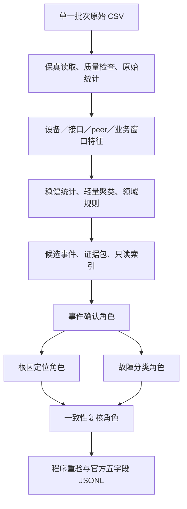

# v4 当前架构、离线交付与追加审查

截至2026-10-09，对照[最初设计](superpowers/specs/2026-10-08-v4-design.md)，v4 主体代码及 LLM 预留接口已经完成。当前按用户要求不连接真实 LLM，Docker 保持暂停。整个研究/比赛项目尚未全部完成：两批全量数据验证、参数选择、真实模型效果及消融仍待实验，不能以代码齐备或 Replay 流程通过替代这些结论。

本次重新阅读生产代码并做一次独立边界审查，修复三处 Important 问题及此前的 Ctrl-C 记录缺口。新增14项测试均先复现失败，再修复通过；全套为 **353 passed**。下文的“完成”表示实现与已有验证覆盖的范围，不承诺不存在任何漏洞。

## 架构与数据流



当前离线入口运行到 E。F–I 的提示词、独立会话、调度、工具协议及校验已实现，真实模型连接留到服务器上。图中定位、分类表示两个相互独立的任务，不承诺网络请求并行执行。

| 层与代码 | 作用 | 关键边界 |
|---|---|---|
| `aiops_v4/data` | 发现七类来源，流式保留原始字段、时间、身份、日志和行位置；统计缺失、零值、分布、时间覆盖及质量 | 缺失不填零；坏时间/未知网元保留并标记；只接受输入根目录内的普通源文件 |
| `aiops_v4/features` | 从原始数据重新生成多粒度窗口；保留资源、链路、路由 peer、业务、采集及日志线索，处理计数器差分和质量 | 不读取 v1–v3 特征库；未知单位明确标记，重置/冲突/长间隔不制造差分 |
| `aiops_v4/states` | median/MAD 参考尺度、有界 k-medoids、状态变化与规则信号共同形成候选 | 聚类得到运行状态，簇号不是故障/健康标签；默认3簇只是实验参数，参考不宣称已知健康 |
| `aiops_v4/evidence` | 关联同网元严格重叠的候选；组织支持、未触发观测、质量/缺失、参考说明、原始锚点及有来源关系 | 包络不等于故障时间；不同网元不猜因果；摘要有界，完整登记证据可以分页补取 |
| `aiops_v4/agents` | 同一后端、同一配置模型，通过不同 system prompt 进行确认、定位、分类和复核；可选状态解释 | 定位和分类读取同样证据且不交换结论，复核才接收双方结果；证据不足明确待判断 |
| `aiops_v4/agents/export.py` 等 | 校验实际确认记录、角色 trace、完整引用交付、候选窗归属与连续区间；生成官方 JSONL | 合法设备/类别配对、五字段、根因最多前五个不补齐；格式合法不等于预测准确 |
| `aiops_v4/experiments` | 统一运行、独立评测、九种消融、比较；保存配置、代码、提示、知识、输入输出及耗时/用量 | 真值只在推理后单独评测；Replay/前缀/局部诊断明确标识；未知费用保持 null |

LLM 参与的是证据确认和解释、根因推断、故障类别判断及语义复核。原始统计、特征计算、聚类、规则、索引查询权限和最终格式校验由程序负责。规则提供可核查线索，公共知识卡及提示提供机制与核验建议，最终角色必须解释支持、反证与缺失，不能仅复述规则结论。

证据工具包括 `query_states`、`query_members`、`query_model`、`query_relations`、`query_raw` 和 `read_chunk`。工具只读并限定本批次登记范围；长内容完整分块读取后才可引用。日志被当作待分析数据，角色没有执行命令或任意读取文件的工具。

`aiops_challenge_2026` 提供官方 schema、公开设备/类别配置及评测器。v4 仅直接复用 `aiops_common.data.observations.city_from_path` 的城市解析辅助，旧差分、聚合、诊断实现不进入新主线。保留的旧特征库用于存档或后续核验，当前特征由原始 CSV 重新生成。

## LLM 接口与当前离线入口

接口位于 [backend.py](../aiops_v4/agents/backend.py)。角色层依赖以下契约：

```python
backend.model
backend.metadata()  # 后端类型、模型及 simulated 等信息
backend.complete(messages, tools, *, role, case_id, turn)
# 返回 Completion(message, usage, model)
```

已有 HTTP 兼容适配器和测试用 Replay 后端；保留适配器不等于本次已经接通供应商。此次没有设置模型/密钥、读取 .env 或调用真实服务。未来服务器上的真实后端通过该接口接入，统计、特征、证据和角色职责不需要为此重写；供应商协议差异仍须实际验证。

新增 [stage1-offline.json](../configs/v4/stage1-offline.json) 和 [stage2-offline.json](../configs/v4/stage2-offline.json)，采用现有 `discovery_only=true` 分支，`max_rows_per_file=null` 表示全量扫描：

```sh
python -m aiops_v4.experiments run --config configs/v4/stage1-offline.json --output-dir outputs/v4/experiments/my-stage1-offline
python -m aiops_v4.experiments run --config configs/v4/stage2-offline.json --output-dir outputs/v4/experiments/my-stage2-offline
```

每次必须使用新输出目录。两批分别统计和拟合，共享方法而不混合学习缓存。相对路径按配置文件目录解析，迁移后须检查 `raw_root`。这些配置中的 Replay 名称/文件是满足配置结构的占位，离线分支不创建后端、不读取占位回放文件、不需要密钥，也不生成模拟诊断。测试把后端构造函数替换为抛错函数，仍能完成原始数据到证据的运行。

输出包含 profile、features、states、evidence 以及显式离线标记；预测文件为空，`backend_calls=0`、`diagnosis_complete=false`、`submission_ready=false`。`status=completed` 只表示本次配置的离线流程成功，不能理解为根因定位/分类完成。

现有 `stage1.json` / `stage2.json` 是未来真实诊断模板，目前不作为本机入口。通用 HTTP 配置的校验会构造适配器检查参数，但不读密钥或发请求；上述两个离线配置连该构造也不发生。

## 追加发现与修复

| 问题 | 复现与影响 | 修复与验证 |
|---|---|---|
| 超范围工具参数（Important） | `offset=2**63` 或极端时间转 UTC 引发 OverflowError，单个错误请求可中断角色/整批运行 | 工具及直接索引查询校验 SQLite 整数范围；UTC 越界转受控 ValueError，角色将溢出兜底为 `invalid_tool_query` / deferred；原始坏时间仍完整保留 |
| 原始来源文件边界（Important） | 命名合法的 CSV 符号链接可指向根目录外，目录/FIFO 也会被发现；可能读外部数据或阻塞 | 发现阶段拒绝源文件符号链接、非普通文件及越界路径，目录内链接也拒绝，避免身份与实际路径不一致；四种输入有回归测试，FIFO 不被打开 |
| 两次扫描内容一致性（Important） | 统计后修改 CSV 内容并恢复相同大小/mtime，窗口扫描仍可能被成功封存 | 比较统计与窗口扫描每文件的来源、列、行数、完成范围及已有 `parsed_records_sha256`，保留原有元数据检查；复现同长度修改时在 features 阶段失败，不发布成功摘要 |
| Ctrl-C 失败记录（此前 Minor） | 阶段运行中 KeyboardInterrupt 没有脱敏失败记录 | 保存 `status=interrupted`、阶段和已完成阶段，重新抛出 KeyboardInterrupt；保留证据，不写成功标记，不存异常敏感文本 |

内容一致性复用两次扫描已经计算的已解析记录摘要，没有新增全原始文件的第三次字节哈希扫描。前缀模式仅保证所扫描前缀一致，不宣称未读部分未变；本地摘要也不抵抗攻击者协调重写全部产物和 seal。源文件发现检查不是针对其他进程恶意并发替换文件的完整操作系统沙箱。

阶段开始前的配置/路径预检查没有已创建的实验输出，不能要求它产生 failure.json；Ctrl-C 记录覆盖阶段执行区间，SIGKILL/断电不保证落盘。

新增 [test_security_boundaries.py](../tests/v4/test_security_boundaries.py) 的11项和 [test_offline_readiness.py](../tests/v4/test_offline_readiness.py) 的3项均有 RED→GREEN 证据。此前339项回归继续通过；本次全套 `python -m pytest -q` 为 **353 passed in 16.79s**。

## 实际离线验证与保护核对

使用修复后的生产代码执行 `public-discovery.json`，结果目录为 [offline-readiness-reviewed](../outputs/v4/experiments/20261009/offline-readiness-reviewed/summary.json)。运行后再次调用 `verify_run`，封存及所有产物哈希通过：

| 范围 | 源文件 | 扫描行 | 窗口 | 候选窗 / 事件 / 证据包 | 原文物化 | 模型调用 / 预测 | 耗时 |
|---|---:|---:|---:|---:|---:|---:|---:|
| 公开样例，每文件前1000行 | 56 | 29,445 | 21,691 | 1,539 / 991 / 644 | 6,013 | 0 / 0 | 17.94秒 |

这是实际 CSV 的前缀流程验证，不是两批全量效果、模型成绩或独占性能基准。运行时旧 HEAD 为 `0566d03` 且工作区有本次修复，摘要准确记录 `git_dirty=true` 及生产代码指纹 `c5d71429a8efc5328f9d8857f77b30959efc95804389bb908f511b91127d3ed8`，不把该运行冒称为旧 HEAD 的干净代码结果。

再次核对543个既有受保护文件：存在性、大小和 mtime 无变化；代表性既有 `public-reviewed/evidence.sqlite` 的 SHA256 仍为 `0f71c3cf302d22f0fe4d7ab8b7d851a29dd81fded57b6a0e901d08e317b21faf`，v3 存档 tag 仍指向 `5e69701053ff41ce0fc83a47311c280c71cd856e`。data、旧 output/outputs、submit.py 与 v3 存档未清理、未覆盖；本次只新增运行目录。未声称对所有原始数据重新做全字节哈希。

## 剩余工作与服务器顺序

1. 将代码及两批原始目录放到服务器，检查 Python 环境与配置路径，在新输出目录跑离线入口。已有 Mac 证据数据库含源文件绝对路径，保留作实验记录；服务器重新构建可补取原文的证据，不能只复制数据库就假设路径自动适配。
2. 两批分别全量统计/状态发现，检查时间与字段语义、参考污染、缺失、候选数量及资源开销。阈值、簇数和参考配置仍需实验选择，不因为代码完成就视为最优。
3. 迁移后再接入同一个真实模型，先验证少量公开候选的工具协议、引用、拒答、用量和时间；之后单独评测定位/分类效果及九种消融，依据错误分析决定是否调整候选/事件合并。

当前没有发现未修复的 Critical/Important 实现问题；这是本次审查范围的结论。真实模型面对日志提示注入时的判断质量、服务器供应商兼容性和两批全量资源/效果仍未实测。只读工具与严格引用限制了可执行动作，但不能证明模型推断总是正确。Docker 和正式提交环境按用户要求继续留待后续处理。

前次整体审查及实际数据结果见 [v4-project-audit](v4-project-audit-2026-10-09.md)，本机命令见 [v4-reproduction](v4-reproduction.md)。
